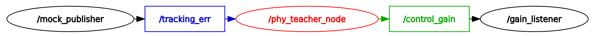

# phy_teacher_ros2


[](https://ubuntu.com/)
[](https://wiki.ros.org/foxy)
[](https://opensource.org/license/apache-2-0)

---

**phy_teacher_ros2** is a ROS 2 package designed for safety-critical control via physics-model-based controller synthesis. It ensures real-time safety by solving Linear Matrix Inequalities (LMIs) constructed from the system dynamics, and publishes safe control gains. 
This system builds upon [**ecvxcone**](https://github.com/Charlescai123/ecvxcone) — a lightweight, embedded solver tailored for general cone programming problems (LP, QP, SOCP, SDP). 

## 🛡️ **`Real-Time Patch`:** **Safe Control under Marginal Conditions**

Consider a general class of discrete-time nonlinear systems, represented in a matrix form as follows:

$$
\begin{aligned}
\mathbf{s}(t+1) = \mathbf{f}(\mathbf{s}(t), \mathbf{a}(t))
                = \mathbf{A}(\mathbf{s}(t)) \cdot \mathbf{s}(t) + {\mathbf{B}}(\mathbf{s}(t)) \cdot \mathbf{a}(t) + \mathbf{g}(\mathbf{s}(t)),  ~~\text{for}~ t \in \mathbb{N}
\end{aligned}
$$

> **Tips:** Here, $\mathbf{s}(t) \in \mathbb{R}^n$ denotes the system state, and $\mathbf{a}(t) \in \mathbb{R}^m$ denotes the control input at time step $t$. The matrices $\mathbf{A}(\cdot) \in \mathbb{R}^{n \times n}$ and $\mathbf{B}(\cdot) \in \mathbb{R}^{n \times m}$ characterize the **state-dependent**, nonlinear dynamics derived from approximate physical modeling. The term $\mathbf{g}(\cdot) \in \mathbb{R}^n$ accounts for unmodeled or residual dynamics which is not captured by the nominal model structure.

To maintain safety under system uncertainty, we introduce a **Real-Time Patch** mechanism. When the system state approaches marginal-safety boundaries at time step $k$, a patch center is formed by:

$$
\begin{aligned}
\mathbf{s}_{k}^* \triangleq \chi \cdot \mathbf{s}(k), \quad \text{wtih} ~~ 0 < \chi < 1,
\end{aligned} 
$$

Defining the deviation $\mathbf{e}(t) \triangleq \mathbf{s}(t) - \mathbf{s}_{k}^*,$ we then apply a state-feedback safe control law:

$$
\begin{aligned}
\mathbf{a}_{\text{safe}}(t) = \mathbf{F}_k \cdot \mathbf{e}(t), \quad \text{where} ~~ \mathbf{F}_k = \mathbf{R}_k \cdot \mathbf{Q}_k^{-1}, \quad \mathbf{P}_k = \mathbf{Q}_k^{-1}
\end{aligned}
$$

with $\mathbf{R}_k$ and $\mathbf{Q}_k$ satisfying the following LMIs conditions:


$$
\begin{aligned}
\mathbf{I}_p - \overline{\mathbf{C}} \cdot \mathbf{Q}_k \cdot \overline{\mathbf{C}}^{\top} \succ 0, \quad \text{and} \quad
\mathbf{I}_q - \overline{\mathbf{D}} \cdot \mathbf{T}_k \cdot \overline{\mathbf{D}}^{\top} \succ 0, \quad \text{and} \quad
\mathbf{Q}_k - n \cdot \mathrm{diag}^2(\mathbf{s}(k)) \succ 0 \quad \text{(1)} \\
\begin{bmatrix}
\mathbf{Q}_k & \mathbf{R}_k^\top \\
\mathbf{R}_k & \mathbf{T}_k
\end{bmatrix} \succ 0, \quad \text{and} ~~~
\begin{bmatrix}
(\alpha - (1 + \frac{1}{\gamma}) \cdot \kappa) \cdot \mathbf{Q}_k & \mathbf{Q}_k \cdot \mathbf{A}^\top(\mathbf{s}(k)) + \mathbf{R}_k^\top \cdot \mathbf{B}^\top \\
\mathbf{A}(\mathbf{s}(k)) \cdot \mathbf{Q}_k + \mathbf{B} \cdot \mathbf{R}_k & \frac{1}{1 + \gamma} \cdot \mathbf{Q}_k
\end{bmatrix} \succ 0 \quad \text{(2)}
\end{aligned}
$$

<table>
  <tr>
    <td>

<!-- Left: Markdown Table -->
  
| Notation                         | Representation       | 
| :-------------:                  | :-------------:      |
| $\kappa$                         | Upper bound of model mismatch |
| $\alpha$, $\gamma$               | Hyperparameters for tuning |
| $\mathbf{A} \succ 0$             | Matrix $\mathbf{A}$ is positive definite | 
| $\mathbf{I}_{n}$                 | Identity Matrix with dimension $n \times n$ |
| $\overline{\mathbf{C}}$          | System marginal-safety boundary |
| $\overline{\mathbf{D}}$          | Constraints for input control action |
| $\mathbf{Q}_k$, $\mathbf{T}_k$   | Auxiliary matrix variables for LMIs |
| $\mathbf{F}_k$                   | Feedback gain matrix from controller |

</td>
<td style="vertical-align: top; padding-left: 0px;">

<!-- Right: Image -->


<p align="center"><b>System Phase Behavior with Real-time Patch</b></p>

</td>
</tr>
</table>


## 💡 Features

- ✅ A real-time safe controller based on physics-model LMIs synthesis  
- ✅ ROS 2 node structure with configurable frequency and CPU core binding
- ✅ Easy integration with Nvidia Jetson platforms and other real hardwares

---

## 🔧 Installation

### 1. Clone the repository

```bash
mkdir -p ~/ros2_ws/src && cd ~/ros2_ws/src
git clone https://github.com/Charlescai123/phy_teacher_ros2.git
```

### 2. Build the workspace

```bash
cd ~/ros2_ws
colcon build --packages-up-to phy_teacher_core --symlink-install
```

### 3. Launch the PHY-Teacher node
```bash
source ~/ros2_ws/install/setup.bash
ros2 launch phy_teacher_core phy_teacher_launch.py
```

This launches the safety controller node, which subscribes to `/tracking_err` and publishes safe gains to `/control_gain`.

---

## 🧰 Testing Tools

### Simulate tracking error input

```bash
ros2 run phy_teacher_core mock_publisher
```

This mocks `/tracking_err` input with random values.

### Subscribe output control gains

```bash
ros2 run phy_teacher_core control_gain_listener
```

You’ll receive safe `Kp` and `Kd` values published from the controller.

---

<p align="center">
  
  <br><b>Figure. ROS 2 Node Graph</b>
</p>

> [!NOTE]
> To meet the real-time performance requirements, `taskset` is used to pin the solver to a dedicated CPU core, which minimizes context-switching overhead on multi-core systems. By default, `phy_teacher node` runs on cpu core `1`. You can modify the assigned core by adjusting the `core_num` parameter in the launch file.

## 🔖 Reference
[1] Yihao Cai, Yanbing Mao, Lui Sha, Hongpeng Cao, and Marco Caccamo. 2025. Runtime Learning Machine. ACM Trans. Cyber-Phys. Syst. (June 2025). https://doi.org/10.1145/3744351


